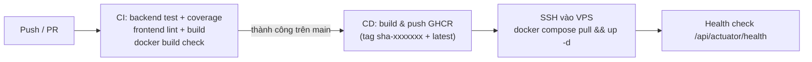

# 🛒 AI Shopping Agent — Trợ lý Tư vấn Mua sắm Thông minh

[](https://github.com/HuynhThinh06/AI_Shopping_Agent/actions/workflows/ci.yml)
[](https://github.com/HuynhThinh06/AI_Shopping_Agent/actions/workflows/cd.yml)
[](https://github.com/HuynhThinh06/AI_Shopping_Agent/actions/workflows/gitguardian.yml)

## 📖 Mô tả đề tài

Hệ thống **AI Shopping Agent** là một trợ lý tư vấn mua sắm thông minh, giải quyết bài toán "quá tải thông tin" trên các sàn thương mại điện tử. Hệ thống cho phép người dùng đặt câu hỏi bằng **ngôn ngữ tự nhiên** (ví dụ: *"Tìm laptop lập trình dưới 20 triệu, pin trâu"*) và tự động:

1. **Trích xuất ràng buộc** từ câu hỏi (ngân sách, danh mục, tính năng) thông qua LLM API
2. **Xếp hạng sản phẩm** đa tiêu chí theo công thức Weighted Scoring (giá, thông số, rating)
3. **Tóm tắt review** ưu/nhược điểm bằng AI, có cache để tối ưu chi phí

**Ngành hàng hỗ trợ:** Laptop & Điện thoại thông minh

---

## 🏗️ Kiến trúc hệ thống

```
┌─────────────────────────────────────────────────────┐
│             React 18 + TypeScript (Vite)             │
│    SearchPage · ResultsPage · ProductDetailPage      │
└────────────────────────┬────────────────────────────┘
                         │ REST API (:8080/api)
┌────────────────────────▼────────────────────────────┐
│           Spring Boot 4 — Layered Monolith           │
│  ┌──────────────┐  ┌─────────────┐  ┌────────────┐  │
│  │ QueryParser  │  │   Ranker    │  │ Summarizer │  │
│  │  (LLM API)   │  │  (Weighted  │  │ (LLM API   │  │
│  │              │  │   Scoring)  │  │ + Cache)   │  │
│  └──────────────┘  └─────────────┘  └────────────┘  │
└────────────────────────┬────────────────────────────┘
                         │ JDBC / JPA
┌────────────────────────▼────────────────────────────┐
│                  PostgreSQL 16                       │
└─────────────────────────────────────────────────────┘
                         ↕ HTTPS
              Google Gemini 3.8 Flash API
```

---

## 🛠️ Tech Stack

| Tầng | Công nghệ |
|---|---|
| **Backend** | Java 21, Spring Boot 4, Spring Data JPA, Spring Validation |
| **Database** | PostgreSQL 16 |
| **LLM** | Google Gemini 3.8 Flash API  |
| **Frontend** | React 18, TypeScript, Vite, Ant Design, TanStack Query |
| **API Docs** | SpringDoc OpenAPI 3 (Swagger UI) |
| **DevOps** | Docker, Docker Compose |
| **VCS** | Git + GitHub |

---

## 📁 Cấu trúc project

```
AI_Shopping_Agent/
├── backend/                        # Spring Boot project (Feature-Sliced Monolith)
│   ├── src/main/java/com/shoppingagent/
│   │   ├── ShoppingAgentApplication.java
│   │   ├── search/                 # Feature: Tìm kiếm & Xếp hạng
│   │   │   ├── SearchController.java
│   │   │   ├── SearchService.java
│   │   │   ├── QueryParserService.java
│   │   │   ├── RankingService.java
│   │   │   ├── SearchQueryRepository.java
│   │   │   ├── SearchResultRepository.java
│   │   │   └── dto/ (SearchRequest, SearchResponse, ExtractedCriteria, RankedProduct)
│   │   ├── product/                # Feature: Quản lý Sản phẩm & Danh mục
│   │   │   ├── ProductController.java
│   │   │   ├── ProductService.java
│   │   │   ├── ProductRepository.java
│   │   │   ├── CategoryRepository.java
│   │   │   └── dto/ (ProductDetailDTO)
│   │   ├── review/                 # Feature: Đánh giá & AI Tóm tắt
│   │   │   ├── ReviewController.java
│   │   │   ├── SummarizerService.java
│   │   │   ├── ReviewFilterService.java
│   │   │   ├── ReviewRepository.java
│   │   │   ├── ReviewSummaryRepository.java
│   │   │   └── dto/ (SummaryDTO)
│   │   └── shared/                 # Thành phần dùng chung (Cross-cutting)
│   │       ├── entity/ (Category, Product, Review, ReviewSummary, SearchQuery, ...)
│   │       ├── llm/ (LlmClient, GeminiClient, Exceptions)
│   │       └── config/ (OpenApiConfig, JsonbConverter)
│   ├── src/main/resources/
│   │   ├── application.properties
│   │   └── application-dev.properties
│   ├── Dockerfile
│   └── pom.xml
│
├── frontend/                       # React + Vite project
│   ├── src/
│   │   ├── pages/                  # SearchPage, ResultsPage, ProductDetailPage
│   │   ├── components/             # Shared UI components
│   │   ├── hooks/                  # Custom React hooks
│   │   ├── api/                    # Axios API client
│   │   └── types/                  # TypeScript interfaces
│   ├── nginx.conf
│   └── Dockerfile
│
├── docker-compose.yml              # Orchestration
├── .env.example                    # Template biến môi trường
├── .gitignore
└── README.md
```

---

## 🚀 Hướng dẫn cài đặt & chạy

### Yêu cầu môi trường

| Tool | Phiên bản tối thiểu |
|---|---|
| Java JDK | 21+ |
| Maven Wrapper | (đã đi kèm trong `/backend`) |
| Node.js | 20+ |
| npm | 10+ |
| Docker & Docker Compose | Docker Desktop 4.x |
| PostgreSQL (local dev) | 16+ |

---

### Cách 1: Chạy với Docker Compose (Recommended)

```bash
# 1. Clone repository
git clone https://github.com/HuynhThinh06/AI_Shopping_Agent.git
cd AI_Shopping_Agent

# 2. Tạo file .env từ template
cp .env.example .env
# Mở .env và điền GEMINI_API_KEY, DB_PASSWORD thực của bạn

# 3. Build & chạy toàn bộ hệ thống
docker compose up --build

# Hệ thống sẵn sàng tại:
#   Frontend : http://localhost:3000
#   Backend  : http://localhost:8080/api
#   Swagger  : http://localhost:8080/api/swagger-ui.html
```

---

### Cách 2: Chạy từng phần (Local Development)

#### Backend (Spring Boot)

```bash
cd backend

# Tạo file .env hoặc set biến môi trường
set GEMINI_API_KEY=your_api_key_here
set DB_PASSWORD=postgres

# Chạy với profile dev
./mvnw spring-boot:run -Dspring-boot.run.profiles=dev
# Windows: mvnw.cmd spring-boot:run -Dspring-boot.run.profiles=dev
```

#### Frontend (React)

```bash
cd frontend

# Cài dependencies lần đầu
npm install

# Chạy dev server
npm run dev
# Frontend tại: http://localhost:5173
```

#### Database

```bash
# Tạo database
psql -U postgres -c "CREATE DATABASE shopping_agent;"

# Chạy schema + seed data
psql -U postgres -d shopping_agent -f ../Database_NV.sql
```

---

## 🔑 Biến môi trường

| Biến | Mô tả | Mặc định |
|---|---|---|
| `GEMINI_API_KEY` | API key Google Gemini | *(bắt buộc)* |
| `GEMINI_MODEL` | Model Gemini sử dụng | `gemini-3.5-flash-lite` |
| `DB_NAME` | Tên database PostgreSQL | `shopping_agent` |
| `DB_USER` | Username PostgreSQL | `postgres` |
| `DB_PASSWORD` | Password PostgreSQL | *(bắt buộc)* |
| `DB_PORT` | Port PostgreSQL | `5432` |
| `BACKEND_PORT` | Port Spring Boot | `8080` |
| `FRONTEND_PORT` | Port Nginx (Docker) | `3000` |
| `SPRING_PROFILES_ACTIVE` | Spring profile | `dev` |

> ⚠️ **KHÔNG** commit file `.env` lên Git. Chỉ commit `.env.example`.

---

## 🔄 CI/CD & Deployment

Pipeline chạy trên **GitHub Actions**, image lưu trên **GitHub Container Registry (GHCR)**, deploy lên **VPS** bằng Docker Compose qua SSH.



| Workflow | Kích hoạt | Nhiệm vụ |
|---|---|---|
| [`ci.yml`](.github/workflows/ci.yml) | Push mọi nhánh, PR vào `main` | `mvnw verify` + JaCoCo, `oxlint` + `vite build`, build thử Docker image |
| [`cd.yml`](.github/workflows/cd.yml) | Sau khi CI **pass** trên `main`; hoặc chạy tay | Build & push image lên GHCR, deploy VPS, health check |
| [`gitguardian.yml`](.github/workflows/gitguardian.yml) | Mọi push/PR | Quét secret bị lộ |
| [`dependabot.yml`](.github/dependabot.yml) | Hàng tuần (thứ Hai) | PR cập nhật Maven, npm, Docker, Actions |

### Quy trình làm việc
1. Tạo nhánh tính năng (`feature/...`) → push → CI chạy tự động.
2. Mở PR vào `main` → CI chạy lại, bot comment **coverage** lên PR.
3. Review & merge → CI chạy trên `main` → **CD tự deploy** lên VPS.

### Thiết lập lần đầu

**1. Chuẩn bị VPS** (Ubuntu 22.04+):
```bash
# Cài Docker + Compose plugin
curl -fsSL https://get.docker.com | sh
# Tạo user deploy và cấp quyền docker
sudo adduser --disabled-password deploy && sudo usermod -aG docker deploy
# Tạo thư mục ứng dụng + file .env (điền giá trị thật: Neon DB, Gemini, Cloudinary)
sudo -u deploy mkdir -p /home/deploy/ai-shopping-agent
sudo -u deploy nano /home/deploy/ai-shopping-agent/.env   # copy nội dung từ .env.example
# Mở firewall cho HTTP
sudo ufw allow OpenSSH && sudo ufw allow 80/tcp && sudo ufw enable
```

**2. Tạo SSH key cho deploy** (trên máy cá nhân):
```bash
ssh-keygen -t ed25519 -C "github-actions-deploy" -f deploy_key -N ""
# Thêm public key vào VPS
ssh-copy-id -i deploy_key.pub deploy@<VPS_HOST>
```

**3. Cấu hình GitHub** (Settings → Secrets and variables → Actions):

| Loại | Tên | Giá trị |
|---|---|---|
| Secret | `VPS_HOST` | IP hoặc domain VPS |
| Secret | `VPS_USER` | `deploy` |
| Secret | `VPS_SSH_KEY` | Toàn bộ nội dung file `deploy_key` (private key) |
| Secret | `VPS_PORT` | *(tuỳ chọn)* mặc định `22` |
| Variable | `APP_URL` | *(tuỳ chọn)* vd `http://1.2.3.4` — mặc định `http://<VPS_HOST>` |
| Variable | `DEPLOY_PATH` | *(tuỳ chọn)* mặc định `ai-shopping-agent` (trong home của user) |

Sau đó tạo **Environment** `production` (Settings → Environments) — có thể bật *Required reviewers* để duyệt trước mỗi lần deploy.

**4. Bảo vệ nhánh `main`** (Settings → Branches → Add rule):
- ✅ Require a pull request before merging (≥ 1 approval)
- ✅ Require status checks to pass: `Backend (build + test + coverage)`, `Frontend (lint + build)`, `Docker build (backend)`, `Docker build (frontend)`

### Truy cập sau khi deploy
| | URL |
|---|---|
| Frontend | `http://<VPS_HOST>/` |
| API | `http://<VPS_HOST>/api/...` |
| Swagger | `http://<VPS_HOST>/api/swagger-ui.html` |
| Health | `http://<VPS_HOST>/api/actuator/health` |

> 🔒 Port `8080` của backend **không** mở ra Internet (chỉ nằm trong mạng Docker) — mọi request đi qua Nginx (`/api`). Cần debug trên VPS:
> ```bash
> cd ~/ai-shopping-agent
> docker compose -f docker-compose.prod.yml logs -f backend
> docker compose -f docker-compose.prod.yml exec backend wget -qO- localhost:8080/api/actuator/health
> ```

### Rollback
Actions → **CD** → *Run workflow* → nhập `image_tag` của bản cũ (vd `sha-abc1234`, xem trong tab **Packages** hoặc file `.deployed_tag` trên VPS). Để trống `image_tag` = build & deploy lại commit mới nhất của `main`.

### Code coverage
- Báo cáo JaCoCo sinh khi chạy `mvnw verify` → `backend/target/site/jacoco/index.html`; trên CI có trong Job Summary, artifact `backend-reports` và comment PR.
- Loại trừ khỏi đo lường: `dto/`, `shared/entity/`, `shared/config/`, `seed/`, class `*Application`.
- **Giai đoạn 1 (hiện tại):** chỉ báo cáo, không chặn build. Mốc ban đầu: **~44% line coverage**.
- **Giai đoạn 2 (dự kiến):** bật ngưỡng chặn — tổng ≥ 40%, dòng code mới trong PR ≥ 60%.

---

